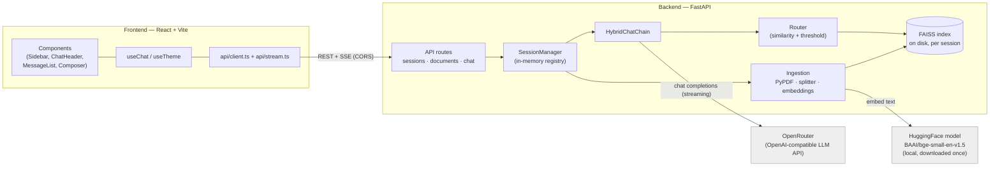
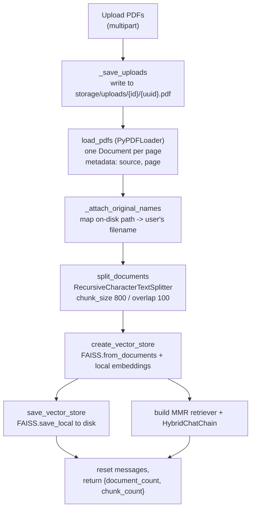
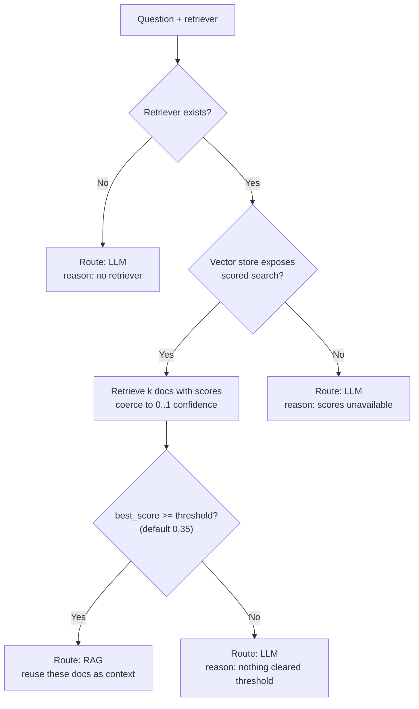
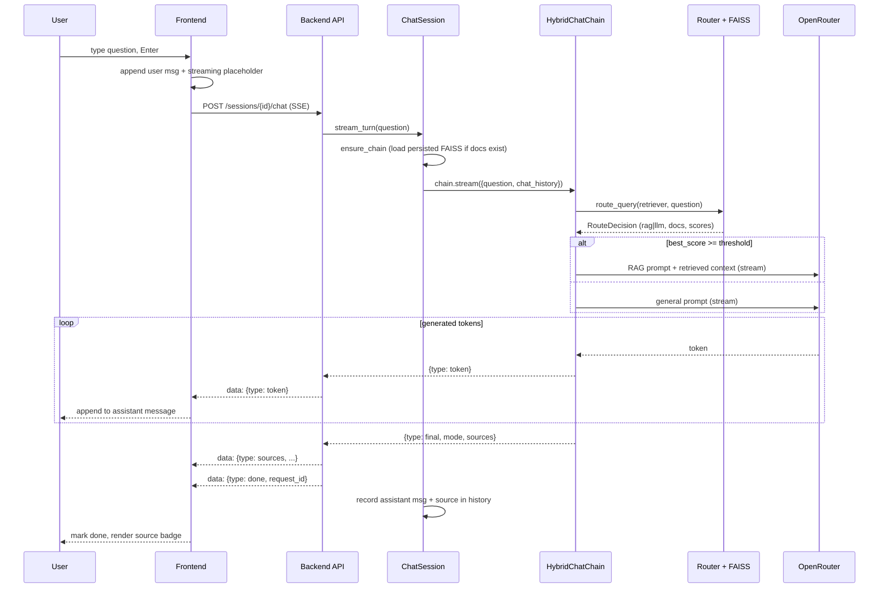

# DocIntel-AI — Architecture

This document explains how DocIntel-AI actually works today: the pieces, how they
fit together, and where the important logic lives. It's written against the code in
`backend/` and `frontend/`, not against a plan. If something here disagrees with the
source, the source wins — please open an issue.

For setup and usage, see [`README.md`](./README.md).

---

## 1. High-level architecture

DocIntel-AI is two independently-run processes:

- a **React + Vite frontend** (the chat UI), and
- a **FastAPI backend** (the RAG pipeline, session state, and LLM calls).

The backend depends on one external service — **OpenRouter** — for text generation.
Everything else (PDF parsing, embeddings, the vector index, retrieval, routing) runs
locally in the backend process.



The frontend talks to the backend over plain HTTP: JSON for most endpoints, and
Server-Sent Events (SSE) for the chat stream. CORS is configured on the backend to
allow the Vite dev origin (`http://localhost:5173` by default).

---

## 2. Repository layout

Only `backend/` and `frontend/` are part of the application (plus the root
`README.md`, this file, and `.gitignore`). Anything else you might see at the repo
root is local scratch, not tracked or used.

```
backend/
  app/
    __init__.py            # loads backend/.env into os.environ before submodules import
    main.py                # FastAPI app, CORS, lifespan (creates storage dirs), /api/health
    api/
      routes/
        sessions.py        # create / status / messages / clear / delete
        documents.py       # PDF upload + processing
        chat.py            # streaming chat (SSE)
      schemas.py           # Pydantic request/response models
      deps.py              # get_session dependency (404 if unknown)
    session/
      manager.py           # ChatSession + SessionManager (state, per-session storage)
    chains/
      chat_chain.py        # HybridChatChain — routes a turn to RAG or general LLM
      router.py            # retrieval + similarity-threshold routing decision
      rag_chain.py         # PDF-grounded chain (prompt | llm | parser)
      llm_chain.py         # general chain (prompt | llm | parser)
    ingestion/
      pdf_loader.py        # PyPDFLoader -> one Document per page
      text_splitter.py     # RecursiveCharacterTextSplitter -> chunks
      embeddings.py        # HuggingFaceEmbeddings singleton (local)
      vector_store.py      # FAISS build / save / load
    retrievers/
      retriever.py         # MMR retriever config over a FAISS store
    models/
      llm_model.py         # ChatOpenAI pointed at OpenRouter (cached singleton)
    prompts/
      chatbot_prompt.py    # the RAG system prompt
    core/
      config.py            # pydantic-settings; env-overridable tunables
    utils/
      logger.py            # colorized/JSON logger with per-turn request IDs
      doc_utils.py         # pure helpers (source names, page labels, vector-store access)
  requirements.txt
  .env.example

frontend/
  index.html               # anti-FOUC theme bootstrap script, #root
  src/
    main.tsx               # React root; imports tokens.css + global.css
    App.tsx                # two-pane layout; wires useChat + useTheme
    types.ts               # shared domain types (mirror the backend contract)
    api/
      client.ts            # typed REST client + error types
      stream.ts            # SSE reader for the chat stream
    hooks/
      useChat.ts           # the client-side conversation state machine
      useTheme.ts          # light/dark theme state + persistence
    components/            # Sidebar, ChatHeader, MessageList, MessageItem,
                           # Composer, UploadPanel, StatusPanel, SourceBadge,
                           # EmptyState, icons
    styles/
      tokens.css           # design tokens; light :root + dark [data-theme="dark"]
      global.css           # reset, base type, scrollbar, theme cross-fade
```

---

## 3. Backend

### 3.1 Application entry and the API layer

`main.py` builds the `FastAPI` app, adds CORS middleware from
`settings.cors_origins`, and mounts three routers under `/api`. A `lifespan` handler
creates the storage directories on startup and logs where they are.

All chat state lives behind session ids. Every session-scoped route resolves its
session through the `get_session` dependency (`api/deps.py`), which returns a 404 if
the id is unknown — this is the signal the frontend uses to detect an expired session
after a backend restart.

| Method & path | Purpose | Response |
|---|---|---|
| `GET /api/health` | Liveness check | `{"status": "ok"}` |
| `POST /api/sessions` | Create a session | `201 {session_id}` |
| `GET /api/sessions/{id}` | Session status (pdfs loaded, counts, mode) | `StatusResponse` |
| `GET /api/sessions/{id}/messages` | Full stored history | `MessagesResponse` |
| `POST /api/sessions/{id}/clear` | Clear messages (keeps documents) | `StatusResponse` |
| `DELETE /api/sessions/{id}` | Delete session + its files | `204` |
| `POST /api/sessions/{id}/documents` | Upload + process PDFs (multipart) | `ProcessResponse` |
| `POST /api/sessions/{id}/chat` | Stream one chat turn | `text/event-stream` |

Request/response shapes are declared as Pydantic models in `api/schemas.py`.

### 3.2 Sessions and state

`session/manager.py` replaces what a single-user Streamlit app kept in
`st.session_state`. Each client owns a `ChatSession` (keyed by an opaque UUID), held
in an in-memory `SessionManager` registry guarded by a lock.

A `ChatSession` holds:

- the message history (`messages`), including each assistant message's resolved source,
- uploaded-PDF metadata (`pdf_names`, `uploaded_files`),
- a lazily-built chat chain and retriever (`_chat_chain`, `_retriever`).

Two things are persisted **on disk per session** under `settings.storage_dir`:

- uploaded PDFs → `storage/uploads/{session_id}/`
- the FAISS index → `storage/vector_stores/{session_id}/` (`index.faiss` + `index.pkl`)

The registry itself is in-memory, so it does not survive a backend restart. The
on-disk indexes do survive, but because a restarted backend no longer knows the old
session id, the frontend gets a 404 and starts a fresh session — leaving the old
index orphaned. There is no cross-session index reuse.

Conversation history sent to the model is the **last 12 messages**
(`HISTORY_WINDOW_MESSAGES`), rendered as `role: content` lines.

### 3.3 Ingestion pipeline

Triggered by `POST /api/sessions/{id}/documents`. The route validates that each
upload looks like a PDF, reads the bytes, and — because loading and embedding are
blocking and CPU-heavy — runs the whole pipeline in a threadpool so the event loop
stays responsive.



Notes that matter downstream:

- **Page numbers.** `PyPDFLoader` records a 0-based `page` in each page's metadata.
  The UI shows 1-based labels via `doc_utils.page_label`.
- **Filenames.** PDFs are stored under random UUID names, so `metadata["source"]` is
  a hex path. `_attach_original_names` writes the user's real filename into
  `metadata["original_name"]`, which is what citations display.
- **Replace, not accumulate.** Processing a new upload rebuilds the index from the new
  chunks only and overwrites the session's saved index. Earlier documents in the same
  session are replaced, and the message history is reset.

### 3.4 Embeddings (local — why no embedding key is needed)

`ingestion/embeddings.py` loads a `HuggingFaceEmbeddings` model
(`BAAI/bge-small-en-v1.5`) as a lazily-created singleton. It runs locally through
`sentence-transformers`/`torch` — no network call, no API key. The model weights are
downloaded from HuggingFace **once** on first use and cached, which is why the first
upload after a fresh install is slower.

This is the reason the app needs only an OpenRouter key: generation is the single
remote step; embedding and retrieval are entirely local.

### 3.5 Vector store and retrieval config

`ingestion/vector_store.py` wraps FAISS: `create_vector_store` builds an index with
`FAISS.from_documents`, and `save_vector_store` / `load_vector_store` persist and
reload it (`allow_dangerous_deserialization=True` is safe here because the app only
ever loads indexes it wrote itself).

`retrievers/retriever.py` turns a FAISS store into a retriever configured for **MMR**
(maximal marginal relevance):

```python
vector_store.as_retriever(
    search_type="mmr",
    search_kwargs={"k": 4, "fetch_k": 10, "lambda_mult": 0.7},
)
```

See the routing section below for an important caveat: this MMR config is present but
the routing path does not currently use it.

### 3.6 Hybrid RAG routing

This is the core of the project. `chains/router.py` decides, per question, whether to
answer from the PDFs (RAG) or from the model's general knowledge (LLM). The rule is
based on **vector similarity**, not on asking the LLM to classify the question.



How the score is produced (`_retrieve_with_scores`):

1. If the store supports `similarity_search_with_relevance_scores`, use those scores
   and clamp them to `[0, 1]`.
2. Otherwise fall back to `similarity_search_with_score` (a distance) and convert it
   with `1 / (1 + distance)`.

If the best score across retrieved chunks is `>= similarity_threshold` (default
`0.35`), the router returns a `rag` decision **and carries the retrieved documents in
the decision** so the RAG chain reuses them directly — retrieval happens once per
turn. Otherwise it returns an `llm` decision.

The decision is a frozen `RouteDecision` dataclass that also carries the scores,
timings, threshold, and retrieved docs, purely so the router can emit a detailed log
of *why* it chose what it chose.

Two honest caveats about this path, both visible in the code:

- **MMR is bypassed.** For a FAISS store, the scored branch above always succeeds, so
  routing calls the vector store's similarity search directly. The MMR retriever from
  §3.5 is only exercised by the score-less fallback (`_retrieve_without_scores`),
  which FAISS doesn't hit. So results are top-k by similarity, not MMR-diversified.
- **Scores aren't cosine similarity.** The embeddings are not normalized, so the 0..1
  value is a monotonic transform of FAISS's L2-based relevance, not true cosine. The
  `0.35` threshold is tuned empirically against that, not against a principled metric.

### 3.7 LLM chains and prompts

`chains/chat_chain.py` defines `HybridChatChain`, which owns both a general chain and
a RAG chain and streams one of them per turn.

Both chains are LangChain LCEL pipelines:

- **General** (`llm_chain.py`): `GENERAL_PROMPT | llm | StrOutputParser()` — a plain
  assistant prompt that takes `chat_history` and `question`.
- **RAG** (`rag_chain.py`): `chat_prompt | llm | StrOutputParser()` — the prompt in
  `prompts/chatbot_prompt.py`, which instructs the model to answer only from the
  provided context, say so when the answer isn't there, and takes `chat_history`,
  `context`, and `question`. `format_docs` builds the context string as
  `Source: <name>, Page: <n>` blocks followed by chunk text.

`HybridChatChain.stream` yields a small internal event stream:

- `{"type": "token", "text": ...}` — one per generated delta
- `{"type": "final", "mode": "rag"|"llm", "sources": [...]}` — exactly once at the end

The routing decision travels **inside** the stream (the `final` event), not via shared
instance state, so a single chain instance can be streamed without callers racing on a
mutable `last_decision`. For RAG, the `final` event's `sources` are the distinct
`{name, page}` pairs of the documents that were actually used.

### 3.8 OpenRouter LLM integration

`models/llm_model.py` creates a single cached `ChatOpenAI` client. OpenRouter is
OpenAI-compatible, so the only change from "normal" OpenAI usage is pointing
`base_url` at OpenRouter and passing the OpenRouter key:

```python
ChatOpenAI(
    model=settings.llm_model,            # e.g. "openai/gpt-4o-mini"
    temperature=settings.llm_temperature,
    streaming=True,
    api_key=settings.openrouter_api_key,
    base_url=settings.openrouter_base_url,  # https://openrouter.ai/api/v1
    default_headers={"HTTP-Referer": "...", "X-Title": "DocIntel-AI"},
)
```

The client is built lazily on first use. If `OPENROUTER_API_KEY` is missing it raises
a clear `RuntimeError` rather than failing deep inside the OpenAI SDK. Switching models
is a config change (`OPENROUTER_MODEL`) — no code edit — because model ids are just
OpenRouter's `<provider>/<model>` strings.

### 3.9 Configuration and environment variables

Configuration is centralized in `core/config.py` using `pydantic-settings`. Settings
use the `DOCINTEL_` env prefix and also read `backend/.env`. The OpenRouter fields use
`AliasChoices` so they accept the conventional bare names *or* the prefixed ones.

A subtlety worth knowing: `backend/app/__init__.py` calls `load_dotenv()` on import,
before any submodule loads. That's needed because a few knobs are read with plain
`os.getenv` at import time (the router tunables in `router.py` and `LOG_FORMAT` in
`logger.py`) rather than through the `Settings` object.

| Variable | Default | Read by | Purpose |
|---|---|---|---|
| `OPENROUTER_API_KEY` | *(empty — required)* | config | OpenRouter API key |
| `OPENROUTER_MODEL` | `openai/gpt-4o-mini` | config | Model id (`<provider>/<model>`) |
| `OPENROUTER_BASE_URL` | `https://openrouter.ai/api/v1` | config | API endpoint |
| `DOCINTEL_LLM_TEMPERATURE` | `0.3` | config | Sampling temperature |
| `DOCINTEL_CHUNK_SIZE` | `800` | config | Text-splitter chunk size |
| `DOCINTEL_CHUNK_OVERLAP` | `100` | config | Chunk overlap |
| `DOCINTEL_RETRIEVER_K` | `4` | config | Chunks returned to the LLM |
| `DOCINTEL_RETRIEVER_FETCH_K` | `10` | config | MMR candidate pool size |
| `DOCINTEL_RETRIEVER_LAMBDA_MULT` | `0.7` | config | MMR relevance vs diversity |
| `DOCINTEL_EMBEDDING_MODEL` | `BAAI/bge-small-en-v1.5` | config | Embedding model name |
| `DOCINTEL_STORAGE_DIR` | `backend/storage` | config | Root for uploads + indexes |
| `DOCINTEL_CORS_ALLOW_ORIGINS` | `http://localhost:5173` | config | Comma-separated CORS origins |
| `HYBRID_RAG_SIMILARITY_THRESHOLD` | `0.35` | `router.py` | Routing confidence cutoff |
| `HYBRID_RAG_TOP_K` | `4` | `router.py` | Fallback retrieval `k` |
| `LOG_FORMAT` | `text` | `logger.py` | `json` for structured logs |

The routing `k` in practice comes from the retriever's `search_kwargs["k"]` (i.e.
`DOCINTEL_RETRIEVER_K`); `HYBRID_RAG_TOP_K` is only the fallback used when a retriever
exposes no `k`.

### 3.10 Logging

`utils/logger.py` is a small structured logger used throughout the pipeline. Each chat
turn gets a short **request id** (a `ContextVar`), so every line for one turn can be
correlated — the router logs its decision, scores, timings, and which chain ran. The
default output is human-readable and colorized; set `LOG_FORMAT=json` for one JSON
object per line. Logs go to `stderr`.

### 3.11 Error handling and fallbacks

The backend prefers degrading to a working answer over failing the request:

- **Router failure** → caught in `HybridChatChain.stream`; the turn falls back to the
  general LLM chain.
- **RAG chain failure mid-stream** → caught; the turn falls back to the LLM chain and
  the logged route is corrected to `llm`.
- **Streaming exception** (`api/routes/chat.py`) → emitted as an SSE
  `{"type": "error", "message": ...}` event; a `{"type": "done"}` event is always sent
  last so the client can finalize.
- **PDF processing failure** → surfaced as a clean `500` with a `detail` message
  instead of a raw traceback.
- **Non-PDF upload** → `400`.
- **Missing OpenRouter key** → `RuntimeError` with instructions, at first LLM use.
- **Unknown session id** → `404` via `get_session`; the frontend treats this as
  "session expired, start a fresh one".

---

## 4. Frontend

### 4.1 Structure and responsibilities

The UI is a two-pane layout (`App.tsx`): a `Sidebar` (brand, new chat, upload, PDF
list, status, clear) and a conversation pane (`ChatHeader`, `MessageList`,
`Composer`). Components are presentational — all backend I/O and state lives in hooks.

| Area | File(s) | Responsibility |
|---|---|---|
| Entry | `main.tsx` | React root, imports global styles |
| Layout | `App.tsx` | Wires `useChat` + `useTheme`; shows a blocker only when there's no working session |
| Conversation state | `hooks/useChat.ts` | Session id, status, messages, streaming lifecycle |
| Theme | `hooks/useTheme.ts` | Light/dark state + persistence |
| REST | `api/client.ts` | One function per endpoint; typed errors |
| Streaming | `api/stream.ts` | SSE frame parsing → handler callbacks |
| Messages | `MessageList`, `MessageItem` | Auto-scroll; markdown rendering (`react-markdown` + `remark-gfm`); typing dots, streaming caret, error note |
| Attribution | `SourceBadge` | RAG pills (`filename · p.N`) or a "General AI Knowledge" chip |
| Upload | `UploadPanel` | Drag-and-drop / file picker, pending list, process button |
| Status | `StatusPanel` | PDF loaded, document count, current mode |
| Empty state | `EmptyState` | Intro, example prompts, capability cards |

### 4.2 The conversation state machine (`useChat`)

`useChat` owns the whole client-side lifecycle:

- **Bootstrap.** On mount, it reads a stored session id from `localStorage`. If present,
  it fetches status + history; on a 404 it discards the id. Otherwise it creates a fresh
  session. (A ref guards against React 18 StrictMode double-invoking the effect.)
- **Send.** Optimistically appends the user message and an empty streaming assistant
  placeholder, then opens the chat stream and patches the trailing assistant message as
  tokens/sources/errors arrive.
- **Session resilience.** Any `SessionNotFound` (404) during send/upload/clear means the
  in-memory backend session is gone; the hook recreates a session and clears local
  history, prompting the user to resend.
- **Upload / clear / new chat.** Mirror the backend: upload resets history, clear empties
  messages, new chat deletes the old session and creates a new one.

### 4.3 REST + SSE client

`api/client.ts` wraps `fetch`, converting network failures into an `ApiError` (status
0) and 404s into a `SessionNotFound` subclass. It also normalizes stored message
sources into the unified `MessageSource` shape used across the UI.

`api/stream.ts` handles the chat stream. The chat endpoint is a `POST` returning
`text/event-stream`, so the browser's GET-only `EventSource` can't be used; instead it
POSTs with `fetch`, reads `response.body`, splits the byte stream into SSE frames on
blank lines, and JSON-parses each `data:` payload. It maps backend events to
callbacks:

| Backend SSE event | Handler |
|---|---|
| `{"type":"token","text"}` | `onToken` — append delta |
| `{"type":"sources","mode":"rag"\|"llm",...}` | `onSources` — normalize to `MessageSource` |
| `{"type":"error","message"}` | `onError` |
| `{"type":"done","request_id"}` | `onDone` (fired once at close) |

### 4.4 Theme architecture (dark mode)

Theming is pure CSS variables plus one attribute:

- **Tokens** (`styles/tokens.css`). `:root` defines the light palette;
  `:root[data-theme="dark"]` re-maps the *same* color tokens to a dark palette. Only
  colors change — spacing, radii, and type tokens are shared. Because components only
  ever reference tokens (never raw colors), flipping one attribute reskins everything.
  Each theme also sets `color-scheme` so native controls and scrollbars match.
- **Anti-FOUC bootstrap** (`index.html`). A tiny inline script runs before React and
  before first paint: it reads the saved theme from `localStorage` (`docintel-theme`),
  falls back to the OS `prefers-color-scheme`, and sets `data-theme` on `<html>`. This
  prevents a flash of the wrong theme on load.
- **Hook** (`hooks/useTheme.ts`). Initializes from the `data-theme` the script already
  applied (keeping React state in lockstep with the painted DOM), then on every change
  writes `data-theme` and persists to `localStorage`. `toggleTheme` flips it; the
  sun/moon button lives in `ChatHeader`.
- **Motion.** `global.css` cross-fades the main surfaces on theme flip, and neutralizes
  that under `prefers-reduced-motion`.

---

## 5. End-to-end chat flow

Putting it together, one chat turn:



---

## 6. Design notes and current constraints

These are architectural facts about the current implementation, kept in sync with the
"Known limitations" list in the README:

- **Retrieval is top-k similarity, not MMR** (§3.6). The MMR retriever is configured but
  the FAISS scored path bypasses it.
- **Similarity scores aren't normalized cosine** (§3.6). Embeddings aren't normalized, so
  the `0.35` threshold is tuned against FAISS's L2-based relevance score.
- **Uploads replace, they don't accumulate** (§3.3). A new upload rebuilds the session's
  index from the new documents only.
- **The session registry is in-memory** (§3.2). Persisted indexes survive a restart, but
  the session that pointed at them does not, so a restart effectively starts fresh.
- **Sources include page numbers** (§3.7). Both the RAG chain and the `SourceBadge` carry
  and render `filename · p.N`.
- **Structured logging is available** (§3.10) via `LOG_FORMAT=json`; the default is
  human-readable text.

None of these are dead ends — the hybrid-routing design is the stable core; the items
above are the concrete next steps.
