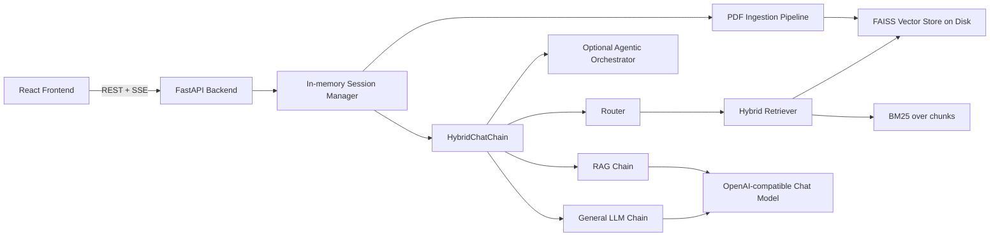
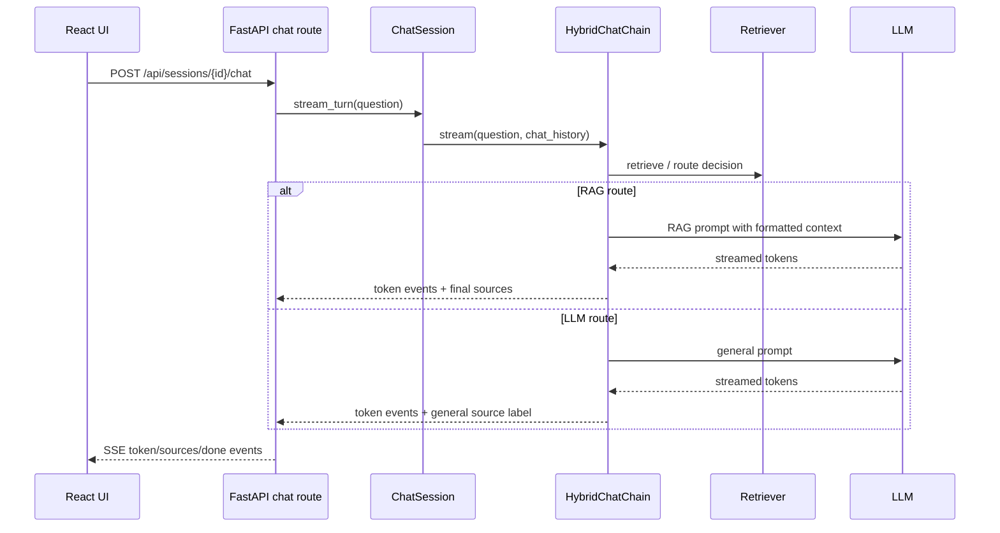

# PROJECT_CONTEXT.md

This document is a source-code-based context file for DocIntel-AI. It is written from the repository contents, not only from README claims. Where the code and documentation differ, the difference is called out explicitly.

## 1. Executive Summary

DocIntel-AI is a full-stack hybrid RAG chatbot for chatting with uploaded PDFs while still allowing normal general-knowledge chat. The frontend is a React + Vite + TypeScript single-page app. The backend is a FastAPI service that manages chat sessions, PDF ingestion, FAISS indexing, hybrid retrieval, route selection, and token streaming over Server-Sent Events.

The core product behavior is:

1. A user creates or resumes a session from the browser.
2. The user optionally uploads one or more PDFs.
3. The backend stores the PDFs, loads pages, splits text into chunks, embeds chunks, builds a FAISS vector index, and wraps it in a hybrid retriever.
4. Each chat question is routed either to RAG over uploaded documents or to the general LLM path.
5. The response streams back token by token.
6. Final response metadata marks either document sources or general AI knowledge.

The project is strongest as a practical applied RAG system: it includes PDF ingestion, persistent vector indexes, hybrid retrieval using FAISS + BM25 + Reciprocal Rank Fusion, an optional agentic retrieval loop, streaming chat, conversation memory, and source attribution.

## 2. One-Line Project Description

DocIntel-AI is a production-style hybrid RAG chatbot that lets users upload PDFs, ask document-grounded questions, and automatically fall back to general LLM answers when uploaded documents are not relevant.

## 3. What The Project Does

At a high level, the project solves this problem: users want one chat interface that can answer from their PDFs when the answer exists there, but should not force every question through document retrieval.

Implemented capabilities include:

- Uploading multiple PDFs per session.
- Loading PDF pages with LangChain's `PyPDFLoader`.
- Splitting pages into overlapping text chunks.
- Generating embeddings with HuggingFace `BAAI/bge-small-en-v1.5`.
- Building a FAISS vector index.
- Rebuilding a BM25 retriever from stored documents.
- Combining FAISS and BM25 results with Reciprocal Rank Fusion.
- Routing questions to either RAG or general LLM.
- Optional agentic retrieval retries with query classification, evidence evaluation, and query rewriting.
- Streaming answers through SSE.
- Returning source file/page attribution for RAG answers.
- Keeping short conversation history for contextual responses.

## 4. What The Project Is Not

The codebase does not implement model training, fine-tuning, LangGraph, tool-calling agents, enterprise authentication, multi-user account management, external database persistence, reranking models, or background job queues.

It is also not a pure RAG-only chatbot. It is intentionally hybrid: questions can route to uploaded PDFs or to the general model.

## 5. Architecture Before A Request

The current architecture is a two-app full-stack system:



The frontend owns UI state and session id persistence. The backend owns all AI behavior, document processing, routing, retrieval, and streaming.

## 6. Main Runtime Flow

### Session startup

1. Frontend calls `POST /api/sessions` if no valid session id exists.
2. Backend creates an in-memory `ChatSession` with a UUID.
3. Frontend stores the session id in `localStorage` under `docintel:session_id`.
4. On refresh, frontend calls status/history endpoints. If the backend returns 404, the frontend creates a fresh session.

### PDF upload and indexing

```mermaid
flowchart TD
  Upload[Browser uploads PDFs] --> Endpoint[POST /api/sessions/{id}/documents]
  Endpoint --> Save[Save files under backend/storage/uploads/{session_id}]
  Save --> Load[load_pdfs with PyPDFLoader]
  Load --> Names[attach original PDF names]
  Names --> Split[RecursiveCharacterTextSplitter]
  Split --> Embed[HuggingFace embeddings]
  Embed --> Index[FAISS.from_documents]
  Index --> Retriever[HybridRetriever: FAISS + BM25]
  Retriever --> Chain[HybridChatChain]
  Chain --> Persist[FAISS save_local under backend/storage/vector_stores/{session_id}]
```

### Chat request



## 7. Backend Structure

Backend source lives under `backend/app`.

- `main.py`: creates FastAPI app, lifespan setup, CORS, route registration, health endpoint.
- `api/routes/sessions.py`: session lifecycle, status, message history, clear, delete.
- `api/routes/documents.py`: PDF upload validation and document processing.
- `api/routes/chat.py`: POST-based SSE streaming chat endpoint.
- `session/manager.py`: in-memory session registry and per-session state.
- `ingestion/*`: PDF loading, chunking, embeddings, FAISS persistence.
- `retrievers/*`: FAISS + BM25 hybrid retriever and retriever factory functions.
- `chains/*`: routing, RAG generation, general LLM generation, orchestration.
- `agents/*`: optional agentic retrieval loop helpers.
- `models/llm_model.py`: OpenAI-compatible chat model construction.
- `prompts/chatbot_prompt.py`: RAG prompt.
- `core/config.py`: settings and environment aliases.
- `utils/*`: logging and document/source helpers.

## 8. Frontend Structure

Frontend source lives under `frontend/src`.

- `App.tsx`: app shell with sidebar, header, messages, and composer.
- `api/client.ts`: typed REST client for session, upload, history, clear, delete.
- `api/stream.ts`: POST + SSE reader for streamed chat responses.
- `hooks/useChat.ts`: main frontend state machine for sessions, messages, upload, streaming, and error recovery.
- `hooks/useTheme.ts`: light/dark theme state.
- `components/Sidebar.tsx`: upload panel, PDF list, new chat, clear chat, status.
- `components/UploadPanel.tsx`: drag/drop and file picker PDF upload UI.
- `components/ChatHeader.tsx`: displays document chat vs general chat mode.
- `components/MessageList.tsx`: message scrolling and empty state.
- `components/MessageItem.tsx`: markdown rendering, streaming indicator, source badge.
- `components/SourceBadge.tsx`: document source pills or general knowledge label.
- `components/Composer.tsx`: auto-growing input, Enter-to-send behavior.
- `styles/*`: CSS variables, reset, global styling.

The UI does not perform retrieval or routing. It only sends questions/uploads and renders streamed backend results.

## 9. API Surface

| Method | Endpoint | Purpose |
| --- | --- | --- |
| `GET` | `/api/health` | Health check. |
| `POST` | `/api/sessions` | Create a new chat session. |
| `GET` | `/api/sessions/{session_id}` | Read session status. |
| `GET` | `/api/sessions/{session_id}/messages` | Read chat history. |
| `POST` | `/api/sessions/{session_id}/documents` | Upload and process PDFs. |
| `POST` | `/api/sessions/{session_id}/chat` | Stream a chat response over SSE. |
| `POST` | `/api/sessions/{session_id}/clear` | Clear chat messages for a session. |
| `DELETE` | `/api/sessions/{session_id}` | Delete session and stored files. |

The chat endpoint returns SSE events shaped roughly as:

- `token`: streamed text chunk.
- `sources`: final source metadata for RAG or general knowledge.
- `error`: backend error message.
- `done`: request id completion marker.

## 10. Data Models

Backend Pydantic schemas include:

- `SessionCreatedResponse(session_id)`
- `StatusResponse(session_id, pdf_loaded, chat_ready, document_count, pdf_names, processing_done, message_count)`
- `ProcessResponse(session_id, pdf_names, document_count, chunk_count, processing_done)`
- `ChatRequest(question)`
- `MessageOut(role, content, source)`
- `MessagesResponse(session_id, messages)`

Frontend TypeScript types mirror the response contracts with `SessionStatus`, `ProcessResult`, `ChatMessage`, and source metadata unions for RAG vs LLM.

## 11. Document Ingestion Details

The ingestion path is implemented in `ChatSession.process_documents`.

Important behavior:

- Uploaded files are saved to `backend/storage/uploads/{session_id}` using UUID filenames.
- Original filenames are kept in metadata so source attribution can show the user-facing PDF name.
- PDFs are loaded page-by-page with `PyPDFLoader`.
- Chunks are created with `RecursiveCharacterTextSplitter` using default `chunk_size=800` and `chunk_overlap=100`.
- Embeddings are loaded lazily and cached through `get_embeddings()`.
- FAISS indexes are persisted under `backend/storage/vector_stores/{session_id}`.
- Uploading new documents resets the session messages and replaces the active document set for that session.

## 12. Retrieval Architecture

The retriever is not plain FAISS only. The current retriever is hybrid:

1. FAISS semantic search retrieves candidate chunks and relevance scores.
2. BM25 lexical retrieval searches the same recovered document chunks.
3. Results are deduplicated by source/page/content hash.
4. Reciprocal Rank Fusion combines FAISS and BM25 ranking lists.
5. The final top chunks are passed to routing/RAG.

The RRF score follows the usual pattern:

```text
score(chunk) = sum(1 / (rrf_k + rank_in_list))
```

Default retrieval settings from code:

- `retrieval_candidates_k = 20`
- `final_context_k = 4`
- `rrf_k = 60`

BM25 is not stored separately. When loading a persisted FAISS index, the code recovers documents from the FAISS docstore and rebuilds BM25 in memory.

## 13. Routing Architecture

There are two routing modes in the code.

### Agentic mode

By default, `agentic_rag_enabled=True`. In this mode, `HybridChatChain` uses `AgenticOrchestrator` when a retriever exists.

Agentic routing flow:

1. Classify query as document-related or general.
2. If general, choose LLM path.
3. If document-related, retrieve candidate evidence.
4. Evaluate whether retrieved chunks are sufficient.
5. If insufficient and attempts remain, rewrite query and retrieve again.
6. If evidence is sufficient, choose RAG.
7. If retrieval found chunks but confidence stayed low, fallback can still choose RAG with strict prompt behavior.
8. If no useful documents are found, choose LLM.

### Legacy/non-agentic mode

If agentic mode is disabled or fails, the code falls back to `route_query` in `chains/router.py`. That router consumes a `HybridRetrievalResult` and creates a `RouteDecision`.

The router still contains semantic, lexical, and agreement evidence policy logic. In agentic mode these signals are used as advisory evidence for the evaluator, not as a standalone prompt builder.

## 14. RAG Generation

The RAG chain is implemented in `chains/rag_chain.py` and `prompts/chatbot_prompt.py`.

The RAG prompt instructs the model to:

- Use uploaded document context as the primary truth.
- Avoid making up document facts.
- Say exactly `I could not find this information in the uploaded documents.` when context does not contain the answer.
- Use chat history for conversational continuity.
- Keep answers professional, friendly, and simple.

Context formatting includes source and page labels before each chunk:

```text
Source: file.pdf, Page: 2
<chunk text>
```

Final source attribution is produced from selected RAG documents, not from frontend inference.

## 15. General LLM Generation

The general path is implemented in `chains/llm_chain.py`.

It uses a separate prompt that tells the model to answer from general knowledge and to use chat history for continuity. The source metadata returned to the frontend is a general-knowledge label rather than file/page citations.

## 16. LLM Provider Configuration

The code uses `ChatOpenAI` from `langchain_openai`, but points it at an OpenAI-compatible API base URL.

Current code defaults:

- Base URL: `https://api.groq.com/openai/v1`
- Model: `openai/gpt-oss-20b`
- Temperature: `0.3`

Environment aliases also support older OpenRouter-style names such as `OPENROUTER_API_KEY` and `OPENROUTER_MODEL`. This means the README/front-end text still says OpenRouter in places, while the code currently defaults to Groq-compatible configuration. That is a documentation/code drift, not a frontend behavior issue.

## 17. Conversation Memory

Conversation memory is simple and in-process:

- Each `ChatSession` stores messages in a Python list.
- The backend sends the last 12 messages into chat generation as `chat_history`.
- Messages are not persisted to a database.
- If the backend process restarts, in-memory sessions disappear.
- The frontend handles stale session ids by creating a new session on 404.

## 18. Streaming Design

Streaming is implemented with POST-based SSE, not browser `EventSource`.

Reason: a chat request needs to send a JSON body containing the question, so the frontend uses `fetch`, reads `response.body`, decodes frames, and processes SSE-style events manually.

Backend streaming events come from `ChatSession.stream_turn`, which delegates to `HybridChatChain.stream`. The frontend inserts a placeholder assistant message, appends token chunks as they arrive, and patches source metadata when the final source event arrives.

## 19. Observability And Logging

The backend has a custom logger in `utils/logger.py`.

Observed logging features:

- Request-scoped ids with a `ContextVar`.
- Text formatter by default.
- JSON formatter when `LOG_FORMAT=json`.
- Key-value event helper.
- Section divider helper.
- Retrieval table logging for FAISS, BM25, fused results, and final chunks.
- Router/agent logs for route decisions and evidence status.
- RAG logs with selected file/page names, context length, and a short context preview.

Caution: logs may include snippets of document content through context previews. That is useful for debugging but may be sensitive in production.

## 20. Persistence Model

Persisted on disk:

- Uploaded PDFs under `backend/storage/uploads/{session_id}`.
- FAISS vector indexes under `backend/storage/vector_stores/{session_id}`.

Kept only in memory:

- Session registry.
- Chat message history.
- Active `HybridChatChain` objects.
- BM25 retriever instances.

The code can reload a FAISS vector store for a known in-memory session if the chain is not already initialized. It does not reconstruct the session registry after a backend restart.

## 21. Security And Privacy Notes

Positive points:

- `.env` is ignored by git.
- The code does not intentionally print API keys.
- Upload validation restricts files to PDFs by extension/content type.
- Sessions use UUID ids.

Risks and gaps:

- There is no user authentication or authorization.
- Session ids are bearer-like identifiers stored in browser localStorage.
- `FAISS.load_local(..., allow_dangerous_deserialization=True)` is used. The code comment says the app only loads indexes it wrote itself; this should remain true because loading untrusted pickle-backed indexes is dangerous.
- Runtime `backend/storage` exists in the working tree; the observed `.gitignore` does not explicitly ignore `backend/storage`.
- Uploaded PDFs and vector stores are stored locally without encryption-at-rest logic in app code.
- Logs can include document context previews.

## 22. Configuration

Key settings from `core/config.py`:

| Setting | Default | Purpose |
| --- | --- | --- |
| `chunk_size` | `800` | Text splitter chunk size. |
| `chunk_overlap` | `100` | Text splitter overlap. |
| `retrieval_candidates_k` | `20` | Number of FAISS/BM25 candidates. |
| `final_context_k` | `4` | Number of final context chunks. |
| `rrf_k` | `60` | Reciprocal Rank Fusion constant. |
| `agentic_rag_enabled` | `true` | Enables agentic retrieval loop. |
| `agentic_max_retrieval_attempts` | `3` | Max retrieval/rewrite attempts. |
| `agentic_evidence_threshold` | `0.70` | Evidence confidence target. |
| `embedding_model` | `BAAI/bge-small-en-v1.5` | HuggingFace embedding model. |
| `llm_temperature` | `0.3` | Main LLM temperature. |
| `cors_allow_origins` | `http://localhost:5173` | Frontend dev origin. |

Settings support `DOCINTEL_` prefixed names and several compatibility aliases.

## 23. Dependencies

Backend dependencies include:

- FastAPI and Uvicorn for the API server.
- Pydantic Settings for config.
- LangChain core/community/openai/huggingface integrations.
- FAISS CPU for vector indexing.
- Sentence Transformers/HuggingFace embeddings.
- Rank BM25 for lexical retrieval.
- PyPDF for PDF loading through LangChain.
- Python multipart for uploads.

Frontend dependencies include:

- React 18.
- Vite.
- TypeScript.
- React Markdown.
- Remark GFM.

No UI framework is used; styling is plain CSS.

## 24. Agentic Retrieval Details

The `agents` package implements a small controlled retrieval loop rather than a general autonomous agent.

Components:

- `query_classifier.py`: determines whether a question should use documents or general knowledge. It has small-talk heuristics and an LLM fallback.
- `evidence_evaluator.py`: asks an LLM to judge whether retrieved excerpts are sufficient to answer the original question, then blends that result with deterministic retrieval signals.
- `query_rewriter.py`: rewrites failed document queries and has a heuristic singular/plural fallback.
- `orchestrator.py`: coordinates classify, retrieve, evaluate, rewrite, retry, and final route decision.
- `state.py`: stores state for the current retrieval attempt loop.

This improves recall for questions whose first retrieval attempt is weak, while keeping a bounded maximum number of attempts.

## 25. Source Attribution

RAG sources are built from selected documents in the route decision. Source objects include file names and page labels derived from metadata.

Important detail: original uploaded PDF names are attached after loading because files are saved internally with UUID names. This preserves clean user-facing citations.

General LLM answers return an empty source list plus a label like `General AI Knowledge`, so the frontend can distinguish document-backed answers from normal answers.

## 26. Error Handling

Examples of current error behavior:

- Missing session id returns 404.
- Invalid or empty PDF upload returns 400.
- PDF processing failures are logged and returned as 500.
- Chat stream exceptions emit an SSE `error` event followed by `done`.
- Frontend handles stale session 404 by creating a fresh session.
- Frontend disables sending while streaming.
- Frontend can retry upload once after recreating a stale session.

## 27. Testing Status

No dedicated test files were found in the source tree after excluding virtual environments, `node_modules`, build output, cache folders, and storage artifacts.

There are build scripts:

- Frontend: `npm run build` runs `tsc && vite build`.
- Backend: no dedicated test script was found in the inspected files.

This means regression confidence currently comes from manual testing, runtime logs, and ad hoc validation scripts if present outside the committed test structure.

## 28. Known Limitations From Code And Docs

Code-supported limitations:

- Sessions are in memory and disappear on backend restart.
- Chat history is not database-persisted.
- Uploaded documents are local files, not object storage.
- BM25 is rebuilt from FAISS docstore and is not independently persisted.
- There is no authentication.
- There is no background queue for expensive PDF processing.
- There is no dedicated reranker model.
- There is no automated test suite found in the source tree.

Documentation/code drift:

- README and some frontend labels mention OpenRouter, but current backend defaults are Groq OpenAI-compatible settings with OpenRouter aliases.
- Frontend README mentions `GOOGLE_API_KEY`, while current backend code expects Groq/OpenRouter-compatible API key aliases.

## 29. SOLID / Separation Of Concerns Assessment

The project has reasonably clear boundaries:

- API routes handle HTTP.
- Session manager handles per-session lifecycle and state.
- Ingestion modules handle PDF loading, chunking, embeddings, and FAISS storage.
- Retriever modules handle search.
- Chains handle generation and orchestration.
- Frontend hooks handle UI state.
- Components handle presentation.

Areas that are still somewhat coupled:

- `ChatSession.process_documents` orchestrates many ingestion steps directly.
- `HybridChatChain` owns fallback behavior, routing coordination, RAG streaming, and LLM streaming.
- The router still contains multiple evidence concepts even though agentic mode may be the dominant route path.
- Provider naming is inconsistent between docs/UI and backend config.

## 30. Good Resume Points

Strong, truthful resume bullets based on the code:

1. Built a full-stack hybrid RAG chatbot with React, FastAPI, FAISS, LangChain, and Server-Sent Events for real-time streaming responses.
2. Implemented multi-PDF ingestion with page loading, chunking, HuggingFace embeddings, FAISS indexing, and source-preserving metadata.
3. Designed a hybrid retrieval layer combining semantic FAISS search and BM25 lexical search with Reciprocal Rank Fusion.
4. Added automatic routing between document-grounded RAG answers and general LLM responses.
5. Built an agentic retrieval loop with query classification, evidence evaluation, query rewriting, and bounded retry logic.
6. Implemented source attribution that cites uploaded PDF names and page numbers for document-backed answers.
7. Created a session-based chat architecture with upload state, message history, vector store persistence, and stale-session recovery.
8. Delivered token-level streaming from FastAPI to React using POST-based SSE and incremental UI rendering.
9. Developed a clean TypeScript frontend with typed API clients, reusable components, markdown rendering, drag-and-drop PDF upload, and theme support.
10. Added structured observability for retrieval, routing, evidence quality, selected sources, context size, and response flow.

## 31. Claims To Avoid Until Implemented

Do not claim the project currently has these unless the code is extended:

- Production authentication or role-based access control.
- Cloud deployment or Kubernetes support.
- Database-backed sessions.
- Enterprise multi-tenant isolation.
- Fine-tuning or model training.
- LangGraph-based orchestration.
- Tool-calling agents.
- Automated CI test coverage.
- Reranker model integration.
- Encrypted document storage.

## 32. Suggested Improvements

Highest-value improvements:

1. Add tests for PDF ingestion, retriever construction, routing decisions, and SSE chat streaming.
2. Align docs/UI/provider naming with the actual Groq/OpenAI-compatible backend configuration.
3. Add explicit `.gitignore` coverage for `backend/storage/` if runtime uploads/indexes should never be committed.
4. Move session metadata and chat history to a persistent store if backend restarts should preserve sessions.
5. Add authentication before exposing uploaded documents beyond local development.
6. Add a background job path for large PDF processing so uploads do not block a request thread.
7. Reduce sensitive logging in production by disabling context previews or gating them behind debug mode.
8. Add a small evaluation set for routing and retrieval quality, especially short personal-fact questions.
9. Consider a reranker only after measuring retrieval failures that FAISS+BM25+RRF cannot solve.
10. Add cleanup/retention policy for uploaded PDFs and vector stores.

## 33. Current Architecture In One Paragraph

DocIntel-AI is a session-oriented FastAPI + React hybrid RAG application. React manages the browser chat experience and streams responses from FastAPI. FastAPI manages in-memory sessions, local PDF upload storage, PDF-to-chunk ingestion, HuggingFace embeddings, FAISS vector indexes, BM25 lexical retrieval, hybrid result fusion, optional agentic retrieval retries, route selection, RAG prompting, general LLM prompting, and source attribution. The architecture is practical and maintainable for a local/full-stack RAG project, with clear next steps around testing, persistence, security, and documentation alignment.
