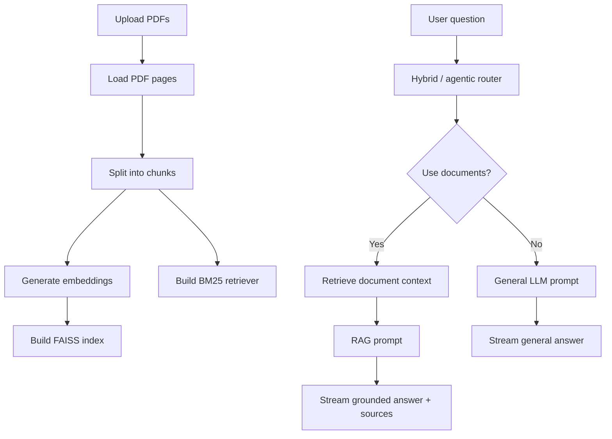

# DocIntel-AI

DocIntel-AI is a hybrid PDF chatbot that can answer from your uploaded documents when the question is document-related, and switch to normal general chat when it is not.

In simple words: upload one or more PDFs, ask questions, and the app decides whether it should use your documents or the general LLM. This keeps document answers grounded while avoiding the common RAG problem where every question is forced through the uploaded files.

## What This Project Does

- Lets you upload and chat with one or more PDFs.
- Uses FAISS for semantic vector search.
- Uses BM25 for keyword-based retrieval.
- Combines both retrieval results with Reciprocal Rank Fusion.
- Routes each question to either RAG or the general LLM path.
- Supports an agentic retrieval loop that can evaluate evidence, rewrite weak queries, and retry retrieval.
- Streams answers token by token to the frontend.
- Shows sources for document-based answers, including PDF name and page.
- Keeps short conversation memory for follow-up questions.
- Provides detailed logs for indexing, retrieval, routing, and generation.

## Why It Exists

Many PDF chatbot demos assume every question is about the uploaded document. That is fine for a small demo, but it feels unnatural in real use.

If a user uploads a resume and then asks, "Who founded Google?", the system should not force random resume chunks into the answer. It should simply answer using general knowledge.

DocIntel-AI is built around that idea. It treats routing as a first-class part of the RAG pipeline.

## How It Works



When PDFs are uploaded, the backend saves them, loads their pages, splits the text into chunks, embeds those chunks, and builds a FAISS vector store. The same chunks are also used to build a BM25 retriever.

When a question arrives, the system retrieves evidence, checks whether the documents are useful for that question, and then chooses the right path:

- **RAG path** for questions that can be answered from uploaded PDFs.
- **General LLM path** for normal questions that do not need the PDFs.

For harder document questions, the agentic layer can rewrite the query and retry retrieval a limited number of times. This helps when the user's wording does not exactly match the wording inside the PDF.

## Tech Stack

| Layer | Technology |
| --- | --- |
| Frontend | React, Vite, TypeScript |
| Backend | FastAPI |
| Streaming | Server-Sent Events over `fetch` |
| LLM Client | LangChain `ChatOpenAI` with an OpenAI-compatible API |
| Default LLM Provider | Groq-compatible config in code |
| Embeddings | HuggingFace `BAAI/bge-small-en-v1.5` |
| Vector Store | FAISS |
| Keyword Retrieval | BM25 |
| Fusion | Reciprocal Rank Fusion |
| Orchestration | LangChain / LCEL plus a lightweight agentic retrieval loop |

## Project Structure

```text
.
├── backend/
│   ├── app/
│   │   ├── api/          # FastAPI routes and schemas
│   │   ├── agents/       # query classification, evidence evaluation, rewriting
│   │   ├── chains/       # chat orchestration, RAG chain, LLM chain, router
│   │   ├── core/         # settings and configuration
│   │   ├── ingestion/    # PDF loading, splitting, embeddings, FAISS storage
│   │   ├── models/       # LLM client setup
│   │   ├── prompts/      # RAG prompt
│   │   ├── retrievers/   # FAISS + BM25 hybrid retrieval
│   │   ├── session/      # chat session state and lifecycle
│   │   └── utils/        # logging and document helpers
│   └── requirements.txt
│
├── frontend/
│   ├── src/
│   │   ├── api/          # REST and streaming clients
│   │   ├── components/   # chat UI components
│   │   ├── hooks/        # chat state and theme state
│   │   ├── styles/       # global CSS and design tokens
│   │   ├── App.tsx
│   │   └── main.tsx
│   └── package.json
│
└── PROJECT_CONTEXT.md    # detailed architecture notes
```

## Running Locally

The app runs as two separate processes:

1. FastAPI backend on `http://localhost:8000`
2. React frontend on `http://localhost:5173`

### Prerequisites

- Python 3.10+
- Node.js 18+
- An API key for an OpenAI-compatible chat provider

### 1. Start The Backend

```bash
cd backend
python -m venv venv
venv\Scripts\activate
pip install -r requirements.txt
```

For macOS/Linux, activate the environment with:

```bash
source venv/bin/activate
```

Create `backend/.env` and add your LLM settings. The current backend defaults are Groq-compatible, but OpenRouter-style aliases are also supported.

Example with Groq-style settings:

```env
GROQ_API_KEY=your_api_key_here
GROQ_MODEL=openai/gpt-oss-20b
GROQ_BASE_URL=https://api.groq.com/openai/v1
```

Example with OpenRouter-style settings:

```env
OPENROUTER_API_KEY=your_api_key_here
OPENROUTER_MODEL=openai/gpt-4o-mini
OPENROUTER_BASE_URL=https://openrouter.ai/api/v1
```

Start the backend:

```bash
uvicorn app.main:app --reload
```

Health check:

```text
http://localhost:8000/api/health
```

The first PDF upload may take a little longer because the embedding model is downloaded locally.

### 2. Start The Frontend

Open a new terminal:

```bash
cd frontend
npm install
npm run dev
```

Open the app:

```text
http://localhost:5173
```

By default, the frontend connects to `http://localhost:8000`. To change that, create `frontend/.env` and set:

```env
VITE_API_BASE=http://localhost:8000
```

## API Endpoints

Interactive API docs are available at:

```text
http://localhost:8000/docs
```

| Method | Endpoint | Purpose |
| --- | --- | --- |
| `POST` | `/api/sessions` | Create a chat session |
| `GET` | `/api/sessions/{id}` | Get session status |
| `GET` | `/api/sessions/{id}/messages` | Get message history |
| `POST` | `/api/sessions/{id}/documents` | Upload and process PDFs |
| `POST` | `/api/sessions/{id}/chat` | Stream a chat response |
| `POST` | `/api/sessions/{id}/clear` | Clear the conversation |
| `DELETE` | `/api/sessions/{id}` | Delete a session |

Chat uses Server-Sent Events with these event types:

```text
token
sources
error
done
```

## Configuration

Most configuration lives in `backend/app/core/config.py` and can be overridden through environment variables.

### Retrieval

```env
RETRIEVAL_CANDIDATES_K=20
FINAL_CONTEXT_K=4
RRF_K=60
```

These control how many chunks are retrieved, how many are used as final context, and how strongly Reciprocal Rank Fusion smooths rankings.

### Agentic RAG

```env
AGENTIC_RAG_ENABLED=true
AGENTIC_MAX_RETRIEVAL_ATTEMPTS=3
AGENTIC_EVIDENCE_THRESHOLD=0.70
```

The agentic layer checks whether retrieved chunks are enough to answer the question. If not, it can rewrite the query and try again. The retry count is capped so the system stays predictable.

### Chunking

```env
DOCINTEL_CHUNK_SIZE=800
DOCINTEL_CHUNK_OVERLAP=100
```

### CORS

```env
DOCINTEL_CORS_ALLOW_ORIGINS=http://localhost:5173
```

## Source Attribution

For document-based answers, the frontend shows the PDF name and page number used by the backend. For general answers, the source is shown as general AI knowledge.

This makes it clear whether an answer came from uploaded documents or from the model's general knowledge.

## Conversation Memory

The backend keeps recent chat history in memory and passes it into the chain for follow-up questions. The frontend stores the current session id in `localStorage`.

If the backend restarts, in-memory sessions are lost. The frontend handles that by creating a fresh session when it receives a 404 for an old session id.

## Known Limitations

This is a strong project, but it is still a local/full-stack RAG app rather than a fully deployed enterprise system.

Current limitations:

- Sessions are stored in memory.
- Chat history is not saved in a database.
- Uploaded files and vector stores are stored locally.
- BM25 is rebuilt in memory from the stored FAISS documents.
- There is no authentication layer yet.
- Large PDF processing happens inside the request flow.
- There is no dedicated reranker model.
- Automated tests are not currently present in the source tree.

## Possible Improvements

Good next steps would be:

- Add automated tests for ingestion, retrieval, routing, and streaming.
- Add authentication before using it with private documents in a shared environment.
- Store session metadata and chat history in a database.
- Add a cleanup policy for old uploads and vector stores.
- Move large PDF processing to a background worker.
- Add optional reranking after measuring retrieval quality.
- Tighten production logging so document snippets are not exposed unnecessarily.

## Author

**SUKHAD TOMAR**
